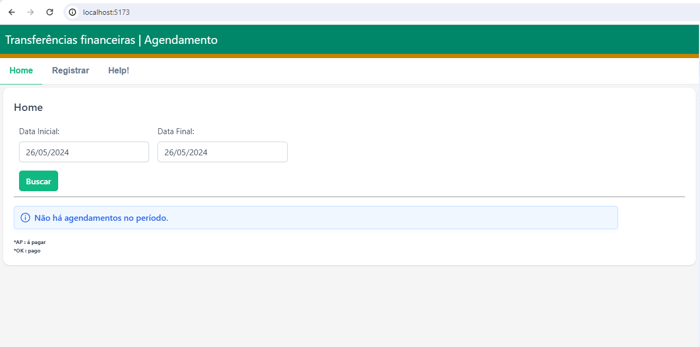
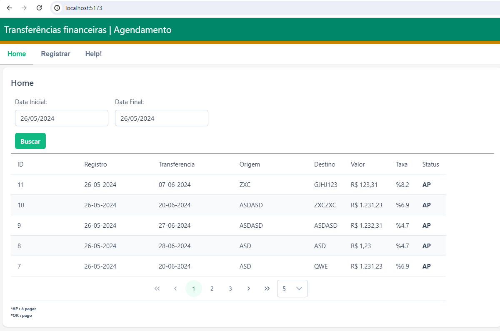
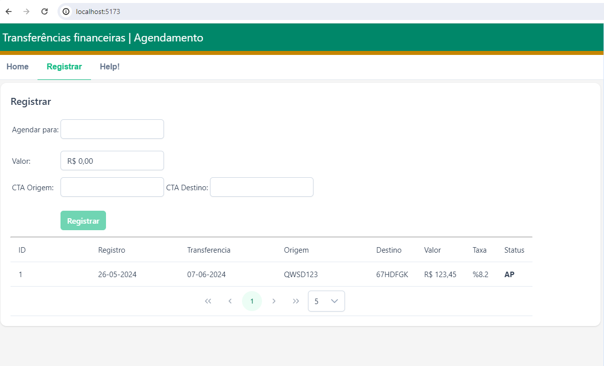
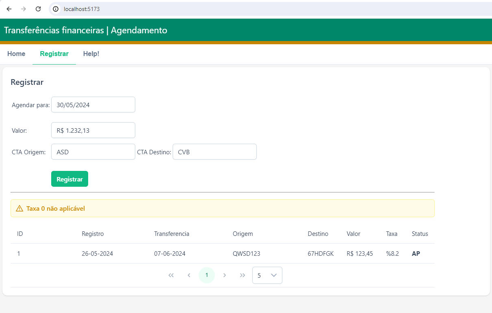
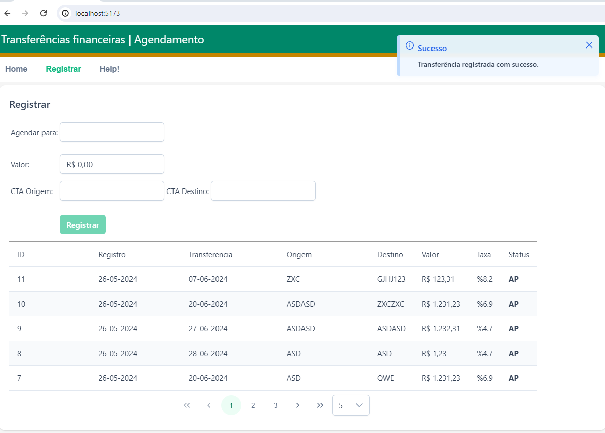

# Agendador de transferências
Este é um frontend de um sistema agendador de transferências bancárias, que são aplicadas taxas dinâmicamente de acordo com o dia agendado.


## 🛠 Tecnologias
- VueJs 3
- Javascript
- HTML
- CSS
- PrimeVue 4
- Backend https://github.com/V1centR/SchedulerTransferTM


## Instalação

Faça o clone do repositório e dentro da pasta schedulerTMFront execute o comando:

```bash
  npm install
```

Após terminado a execução do install digite:

```bash
  npm run dev
```

[](https://www.linkedin.com/in/vicent-ramos-33954ab5/)


## Screenshots









